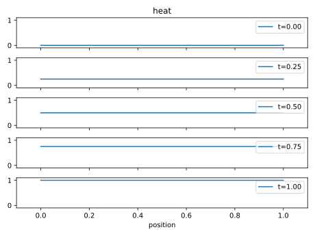
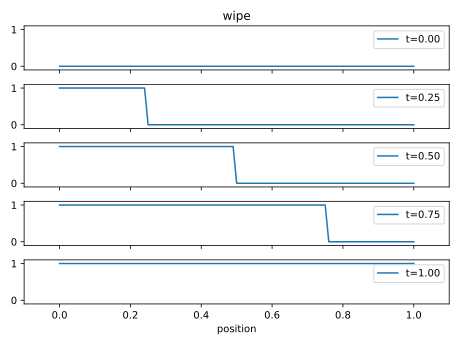
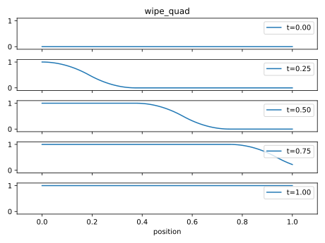
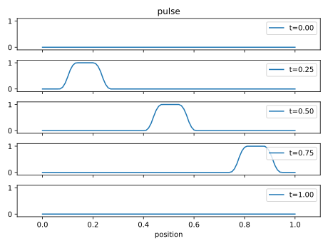
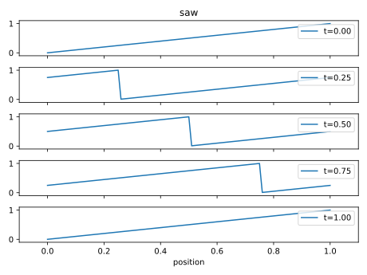
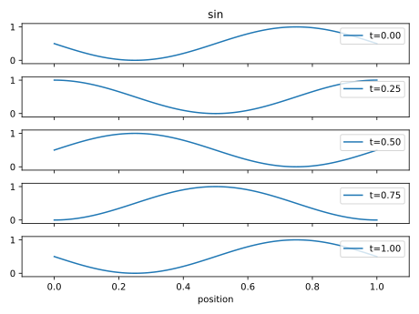

# Shape Examples

| name      | img                                         | formula                                                            |
| --------- | ------------------------------------------- | ------------------------------------------------------------------ |
| heat      |            | $y=t$                                                              |
| wipe      |            | $y = H((t-\epsilon) -\frac{p}{a+2 \epsilon})$                      |
| wipe_quad |  | $y = H'((t-\epsilon) -\frac{p}{a+2 \epsilon})$                     |
| pulse     |          |                                                                    |
| saw       |              | $y=\mathrm{ceil}(t-\frac{p}{1+\epsilon})-(t-\frac{p}{1+\epsilon})$ |
| sin       |              | $y=\frac{1}{2}\sin(2\pi(t-p))+\frac{1}{2}$                         |
